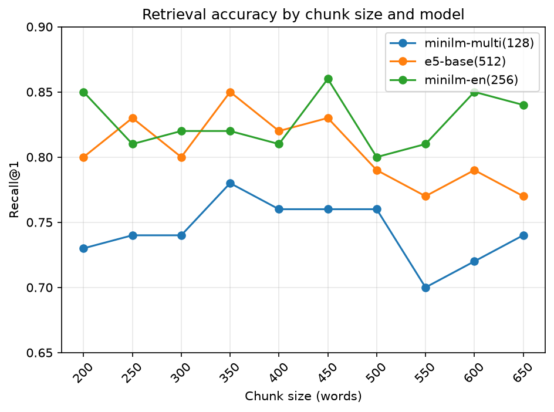
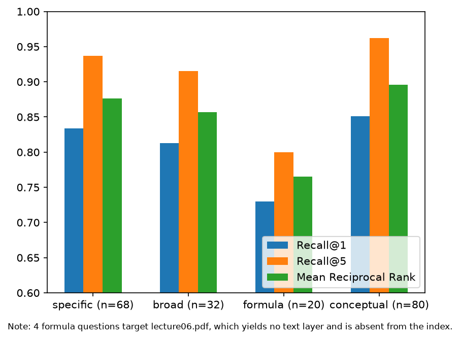

# Semantic Document Search
A semantic search engine over PDF corpora, benchmarked across 3 embedding models and 10 chunk sizes with Recall@1/@5 and MRR.

[Live Demo](https://search.asadbutt.de)


## Evaluation

Retrieval quality was measured on a set of 100 labelled queries against the lecture-slide corpus, across 3 embedding models and 10 chunk sizes (200–650 words). Accuracy isn't a useful metric here — always predicting "not relevant" already scores 99.8% — so results are reported as **Recall@1**, **Recall@5**, and **MRR** (Mean Reciprocal Rank).

### Model Comparison

Mean over 10 chunk sizes, hybrid search off:

| Model | Tokens | Recall@1 | Recall@5 | MRR |
|-------|--------|----------|----------|-----|
| all-MiniLM-L6-v2 (en) | 256 | 0.827 | 0.930 | 0.870 |
| multilingual-e5-base | 512 | 0.805 | 0.916 | 0.851 |
| paraphrase-multilingual-MiniLM-L12-v2 | 128 | 0.743 | 0.884 | 0.794 |



**Key findings:**

The English-only model outperforms the multilingual MiniLM at every single chunk size (10/10, p ≈ 0.001 by sign test) despite having a smaller token window — language match beats model size. Against E5, the gap narrows to 7/10 chunk sizes (p ≈ 0.17), which isn't strong enough to call a clear winner. E5 also shows a decline beyond roughly 450 words per chunk, consistent with its 512-token limit being exceeded. Both MiniLM models stay essentially flat across all chunk sizes, since they truncate long chunks anyway — changing chunk size mostly just changes how many chunks exist, not what gets encoded. All three models nominally peak around 350 words per chunk.

### Category Breakdown

For all-MiniLM-L6-v2, mean over 10 chunk sizes:

| Category | n | R@1 | R@5 | MRR |
|----------|---|-----|-----|-----|
| conceptual | 80 | 0.851 | 0.963 | 0.896 |
| formula | 20 | 0.730 | 0.800 | 0.765 |
| broad | 32 | 0.813 | 0.916 | 0.857 |
| specific | 68 | 0.834 | 0.937 | 0.876 |



### Why formula queries score lower

All 4 permanent failures in the "formula" category target a single file, `lecture06.pdf`, which contributes **zero chunks** to the corpus — it's an image-based PDF with no text layer, so nothing could ever be extracted from it. The apparent conceptual/formula performance gap is therefore a document-level effect, not a weakness in matching formulas semantically. This also explains why Recall@5 is capped at 0.96 across every configuration tested: those 4 queries can never be answered correctly no matter which model or chunk size is used.

### Eval Set

100 queries over 20 PDFs, generated with an LLM using each PDF as context and then hand-reviewed. Each query is anchored to material unique to its target file. Fields per query: `query`, `file_name`, `content_type` (conceptual/formula), `specificity` (broad/specific).

**Caveat:** LLM-generated queries may phrase things closer to the source wording than a real user would, which can inflate retrieval scores somewhat.


 ## Architecture

 ```mermaid
flowchart LR
    Browser["Browser"]

    subgraph compose["Docker Compose · Hetzner"]
        Caddy["Caddy<br/>TLS termination"]
        Nginx["nginx<br/>serves React build"]
        Backend["FastAPI backend"]
    end

    Data[("data/<br/>chunks + embeddings (.npy)")]

    Browser -- HTTPS --> Caddy
    Caddy --> Nginx
    Nginx -- "/api/*" --> Backend
    Backend -. loads at startup .-> Data
```

## Tech Stack

**Backend**
- Python
- FastAPI
- sentence-transformers
- numpy (manual cosine similarity, no vector DB)

**Frontend**
- React
- TypeScript
- Vite
- Mantine (component library)

**Deployment**
- Docker Compose (backend, frontend, caddy services)
- nginx (serves Vite build, proxies `/api/` to backend)
- Caddy (reverse proxy, automatic HTTPS)
- Hetzner Cloud (Ubuntu 24, 4 GB RAM)

## Features

- Natural-language search over a PDF corpus using embedding similarity
- Hybrid search with an additive term-match bonus (keyword + semantic signal combined)
- Loading state, error handling, and empty-query guard
- Example query buttons for a quick first try
- Clickable links to the source arXiv paper for each result

 ## Limitations

- **No OCR** — image-based PDFs (scanned slides, no text layer) yield zero extractable chunks
- **Linear scan** — cosine similarity is computed against every chunk; fine at ~500 chunks, won't scale to millions without an index
- **Hybrid search is an additive bonus, not true hybrid retrieval** — a real implementation would combine BM25 and embedding scores via something like Reciprocal Rank Fusion (RRF)
- **Token truncation** — MiniLM-based models only encode the first ~90 words of a chunk; longer chunks are silently cut off
- **Eval set is LLM-generated** — phrasing may sit closer to the source wording than a human query would, which can inflate the reported scores


## Setup / Run locally

1. Clone the repo
   \```bash
   git clone https://github.com/<your-username>/semantic-doc-search.git
   cd semantic-doc-search
   \```

2. Build the local corpus (downloads arXiv papers, chunks and embeds them)
   \```bash
   python fetch_arxiv.py
   python read.py
   \```
   This populates `data/` with chunk JSON and `.npy` embedding files used by the backend.

3. Start the full stack
   \```bash
   docker compose up --build
   \```

4. Open `http://localhost` in your browser.

## Project Structure

```
semantic-doc-search/
api.py — FastAPI endpoints
search.py — search logic (search_chunks function)
read.py — text extraction, chunking, model loading
eval.py — evaluation script (Recall@1, Recall@5, MRR)
plot.py — matplotlib charts
fetch_arxiv.py — downloads papers from arXiv API
Dockerfile — backend container
docker-compose.yml — full stack (backend, frontend, caddy)
Caddyfile — reverse proxy config
requirements.txt
eval.json — 100 labelled queries
data/ — chunk JSON + vector .npy files (gitignored)
images/ — matplotlib PNGs for README
frontend/
Dockerfile — multi-stage: node build → nginx
nginx.conf — proxies /api/ to backend:8000
src/
App.tsx — main component
ResultList.tsx — extracted result display component
types.ts — SearchResult interface
```
